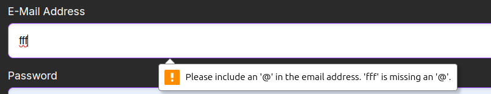
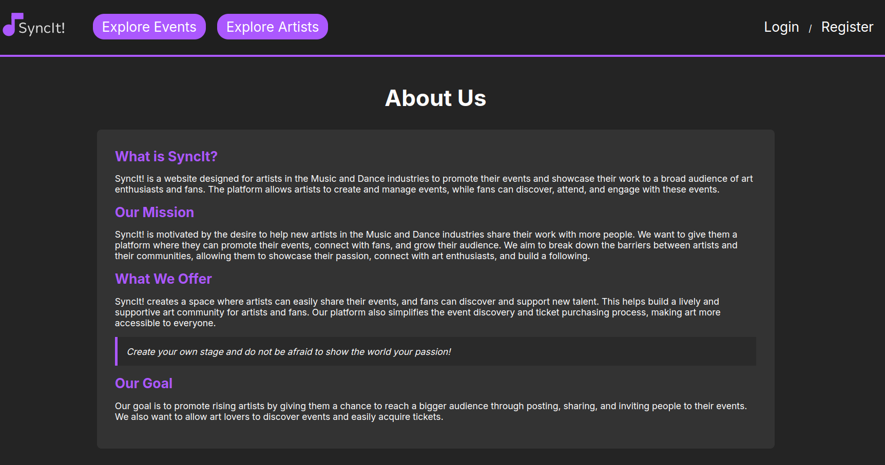
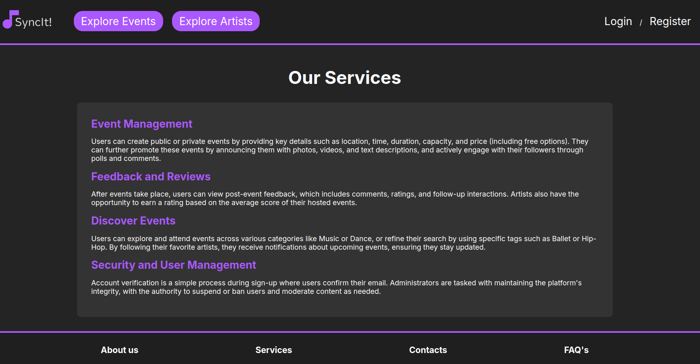
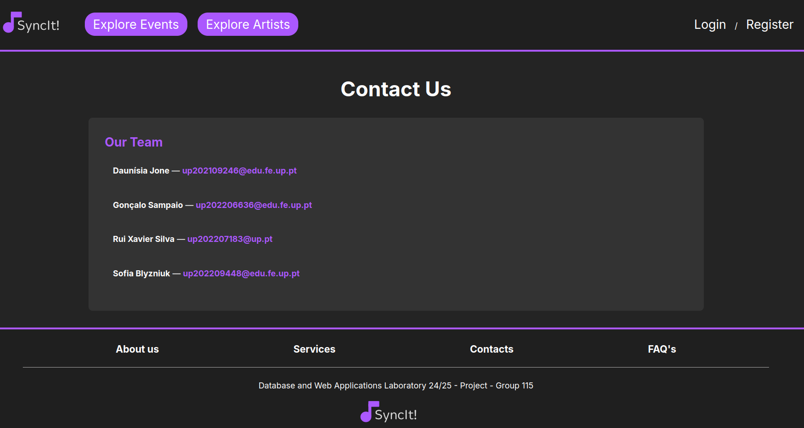
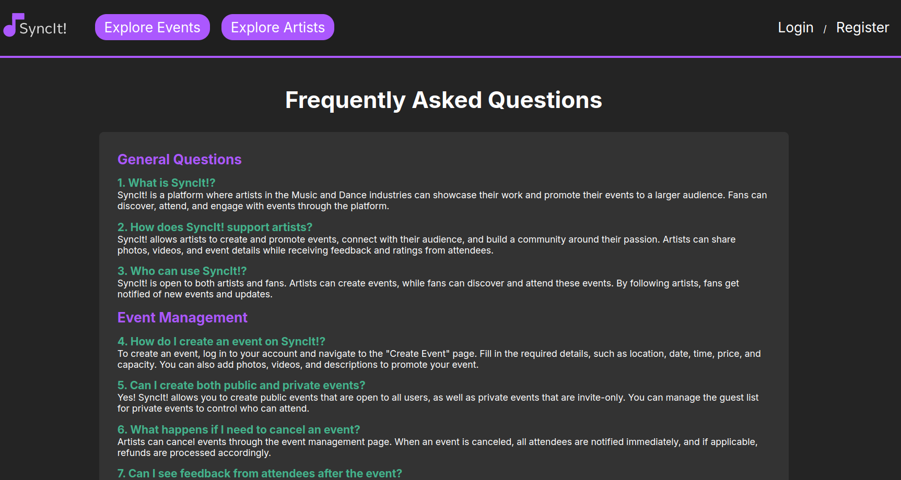
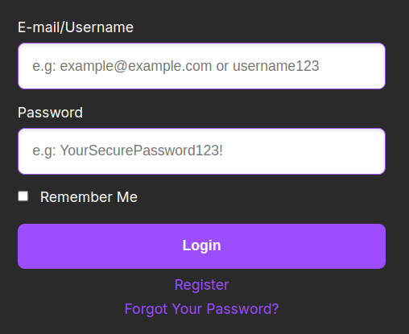

# PA: Product and Presentation
SyncIt! is a website designed for artists in the Music and Dance industries to promote their events and showcase their work to a broad audience of art enthusiasts and fans. The platform allows artists to create and manage events, while fans can discover, attend, and engage with these events.

## A9: Product

SyncIt! is designed to simplify the event discovery process for users, allowing them to easily browse events by category and purchase tickets with just a few clicks. Users can explore artists' profiles to view their upcoming events, making it effortless to connect with and support their favorite performers.
The platform's intuitive interface ensures that finding and promoting events is straightforward, empowering both artists and fans to engage with the vibrant music and dance community. SyncIt! aims to foster meaningful connections between artists and their audiences.

# 1. Installation

The release with the final version of the souce code can be found here : ****MISSING****

To start the image available, the following Docker command can be used: `docker run -it -p 8000:80 --name=lbaw24115 -e DB_DATABASE="lbaw24115" -e DB_SCHEMA="lbaw24115" -e DB_USERNAME="lbaw24115" -e DB_PASSWORD="gNf0WzUGVL" git.fe.up.pt:5432/lbaw/lbaw2425/lbaw24115`

# 2. Usage
**2.1. Administration Credentials**

Administration URL: 

| Username  | Password                                                                                           |
|-----------------|-------------------------------------------------------------------------------------------------------|
| edgar@example.com        |  12345678                          |

**2.2. User Credentials**

| Username  | Password                                                                                           |
|-----------------|-------------------------------------------------------------------------------------------------------|
| edgar        |  12345678                          |

# 3. Application Help

Help features have been implemented throughout the SyncIt! platform to enhance user experience and provide assistance when needed. These include:
* Alert messages: The system displays contextual alerts for various user actions, providing immediate feedback and guidance.

Figure 1: SyncIt! email format alert 

* Static pages: Dedicated help resources are available through static pages such as:

**About Us:** Offers detailed information about SyncIt!, its mission, and the goal that drives the platform.

Figure 2: SyncIt! About Us page 

**Services:** Users can learn about the various services offered by SyncIt!, helping them understand how to make the most of their experience.

Figure 3: SyncIt! Services page 

**Contacts:** Provides users with contact information for support and inquiries, ensuring they can easily reach out for help when needed.

Figure 4: SyncIt! Contacts page 

**FAQs:** The Frequently Asked Questions page addresses common queries, offering quick answers and guidance on using the platform effectively.

Figure 5: SyncIt! FAQs page 

* Input field placeholders: To assist users in entering correct information, input fields are equipped with descriptive placeholders that indicate the expected content.

Figure 6: SyncIt! login input fields 

* Clearly labeled buttons: All buttons on the platform are distinctly labeled to ensure users understand their functions at a glance.

Figure 7: SyncIt! labeled buttons 

# 4. Input Validation

# 5. Check Accessibility and Usability

Accessibility: files/Checklist de Acessibilidade - SAPO UX.pdf

Usability: files/Checklist de Usabilidade - SAPO UX.pdf

# 6. HTML & CSS Validation

HTML Validation: *********

CSS Validation: **********

# 7. Revisions to the Project

# 8. Implementation Details
**8.1. Libraries Used**

* Laravel, for serve-side management

**8.2. User Stories**
This subsection includes all high and medium priority user stories, sorted by order of implementation. 

| US Identifier | Name        | Module   | Priority | Team Members               | State |
|---------------|-------------|----------|----------|----------------------------|-------|
| US01          | US Name 1   | Module A | High     | **John Silva**, Ana Alice  | 100%  |
| US02          | US Name 2   | Module A | Medium   | **Ana Alice**, John Silva  | 75%   |
| US03          | US Name 3   | Module B | Low      | **Francisco Alves**        | 5%    |
| US04          | US Name 4   | Module A | Low      | -                          | 0%    |

Here’s an updated list of all user stories and the modules they belong to:

Module M01: Authentication
US12: Create account (High) – Responsible: Daunísia Jone, (100%)
US13: Login (High) – Responsible: Gonçalo Sampaio (100%)
US15: Logout (High) – Responsible: Sofia Blyzniuk (100%)
US18: Reset password (Medium) – Responsible: Daunísia Jone, Sofia Blyzniuk (100%)

Module M02: Users
US20: View profile (High) – Responsible: Xavier Silva (100%)
US21: Edit profile (High) – Responsible: Xavier Silva (100%)
US23: Upload a profile picture (Medium) – Responsible: Sofia Blyzniuk (100%)
US24: View personal notifications (Medium) – Responsible: Gonçalo Sampaio (100%)
US25: View event messages (Medium) – Responsible: Xavier Silva, Daunísia Jone (100%)
US26: View attendees list (Medium) – Responsible: Daunísia Jone, (100%)
US27: Comment (Medium) – Responsible: Sofia Blyzniuk, Daunísia Jone (100%)
US28: Edit comments (Medium) – Responsible: Gonçalo Sampaio, Daunísia Jone, Sofia Blyzniuk (100%)
US29: Vote in comments (Medium) – Responsible: Xavier Silva, Daunísia Jone (80%)
US30: Delete comments (Medium) – Responsible: Daunísia Jone (0%)
US31: Answer polls (Medium) – Responsible: Sofia Blyzniuk (0%)
US33: Reminder (Medium) – Responsible: Xavier Silva (?%)
US34: Past events (Medium) – Responsible: Daunísia Jone, (100%)

Module M03: Events and Tickets
US01: Find events (High) – Responsible: Sofia Blyzniuk (100%)
US02: Check event details (High) – Responsible: Gonçalo Sampaio (100%)
US03: Past events (High) – Responsible: Xavier Silva (100%)
US04: Search and filter events (High) – Responsible: Daunísia Jone, (100%)
US05: Artist page (High) – Responsible: Sofia Blyzniuk (100%)
US16: Create events (High) – Responsible: Gonçalo Sampaio (100%)
US17: Invite users (High) – Responsible: Xavier Silva (100%)
US19: Join/leave events (High) – Responsible: Sofia Blyzniuk (100%)
US22: Purchase tickets (High) – Responsible: Daunísia Jone, (100%)
US36: Review (Medium) – Responsible: Gonçalo Sampaio, Daunísia Jone (100%)
US40: Edit event (High) – Responsible: Gonçalo Sampaio (100%)
US41: Manage event participants (High) – Responsible: Xavier Silva (?%)
US42: Create polls (Medium) – Responsible: Daunísia Jone, Sofia Blyzniuk (0%)
US44: Manage event visibility (Medium) – Responsible: Gonçalo Sampaio (100%)
US48: Feedback (Low) – Responsible: Gonçalo Sampaio, Daunísia Jone (100%)
US52: Browse events (Medium) – Responsible: Gonçalo Sampaio (100%)

Module M04: Administration
US49: Search for users (High) – Responsible: Xavier Silva (100%)
US50: Edit user accounts (High) – Responsible: Daunísia Jone, (100%)
US51: Create user accounts (High) – Responsible: Sofia Blyzniuk (100%)
US53: View event details (Medium) – Responsible: Xavier Silva (100%)
US54: Manage event reports (Medium) – Responsible: Daunísia Jone, (?%)
US55: Delete events (Medium) – Responsible: Sofia Blyzniuk (0%)
US56: Block and unblock users (Low) – Responsible: Gonçalo Sampaio (100%)
US57: Delete user accounts (Low) – Responsible: Xavier Silva (0%)

Module M05: Notifications
US35: Notification for event changes (Medium) – Responsible: Sofia Blyzniuk (?%)

## A10: Presentation

---

## Revision history

**GROUP24115, 26/11/2024**

* Daunísia Jone, up202109246@edu.fe.up.pt
* Gonçalo Sampaio, up202206636@edu.fe.up.pt
* Rui Xavier Silva, up202207183@up.pt (Editor)
* Sofia Blyzniuk, up202209448@edu.fe.up.pt

