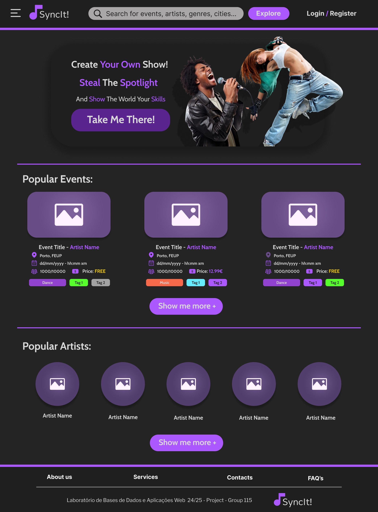
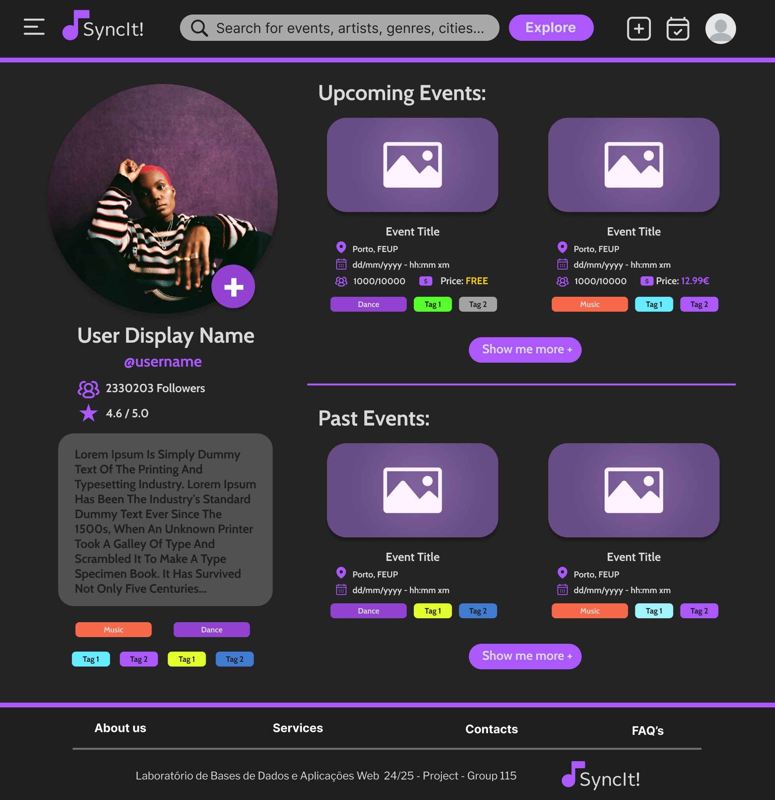
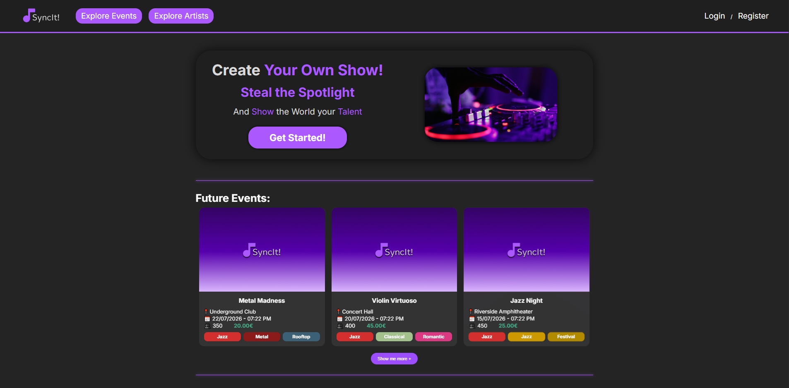
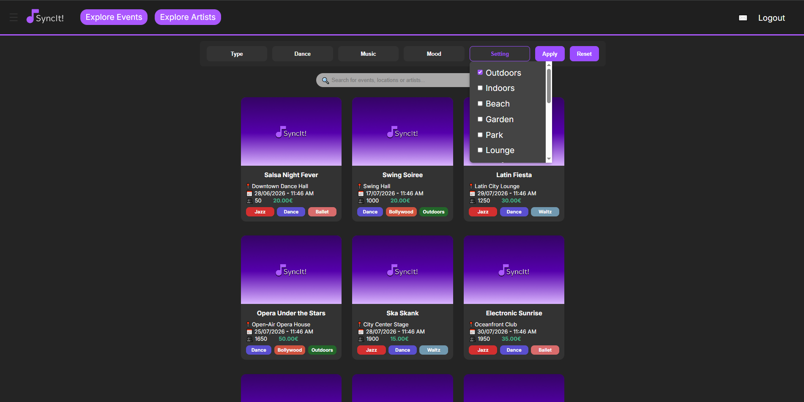
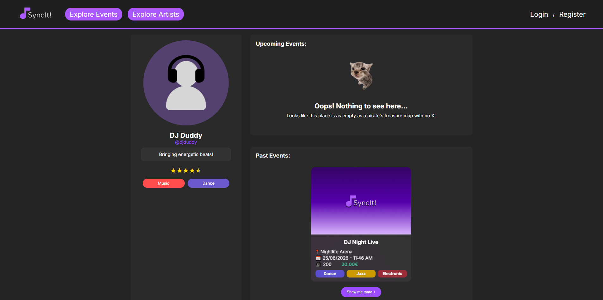
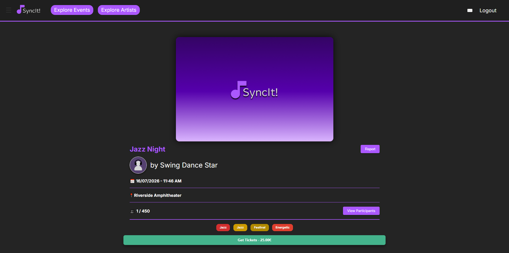
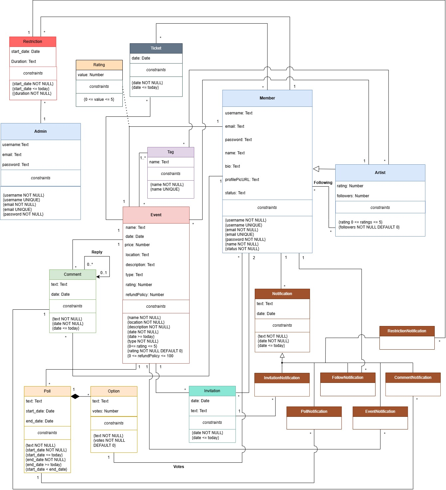

# **SyncIt!**

> Web application for discovering, promoting, and managing music and dance events.


## About the Project

**SyncIt!** is a web application designed for artists in the Music and Dance industries to promote their events, showcase their work, and connect with a broader audience of fans and art enthusiasts. The platform allows artists to create and manage events, while users can discover events, purchase tickets, interact with artists, and engage with the community through comments, ratings, polls, invitations, and notifications.

The project was developed as an academic web application for the Database and Web Applications Laboratory course.

The application supports the following main user roles:

- Visitors: browse public events, view event details, search for artists, and create an account.
- Members: buy and refund tickets, follow artists, comment on events, vote in polls, receive notifications, and manage their profile.
- Artists: create and manage public or private events, invite users, manage participants, and receive feedback through ratings and comments.
- Administrators: manage users, moderate reports, restrict accounts, and supervise platform activity.

## Features

- Create and manage public or private events
- Browse upcoming, past, and featured events
- Search and filter events by category, tags, date, price, and other criteria
- View detailed event pages with description, location, price, capacity, media, comments, and ratings
- Purchase and refund event tickets
- Request access to private events
- Invite users to events
- View and manage event participants
- Follow artists and explore artist profiles
- Comment on events and vote on comments
- Create and answer event polls
- Rate attended events
- Receive notifications about events, invitations, comments, refunds, and platform updates
- Edit user profiles and upload profile pictures
- Report inappropriate events
- Admin moderation for users, reports, restrictions, and account status
- Static informational pages such as About Us, Services, Contacts, and FAQ
- Server-side and client-side input validation
- Responsive web interface for different screen sizes

## UI Mockups

### Home Page



### Artist Page



## Tech Stack

### Frontend

- HTML5
- CSS3
- JavaScript
- Blade templates
- Vite

### Backend

- PHP
- Laravel 10
- Laravel authentication
- Laravel validation
- Laravel hashing
- Laravel Socialite

### Database

- PostgreSQL
- Relational database model
- SQL seed script
- Database indexes
- Database triggers
- Database transactions
- Full-text search support

### Architecture

- MVC architecture
- Server-side rendered web application
- Route-controller-model structure
- Role-based access control
- REST-style web resources
- OpenAPI documentation

### DevOps / Local Development

- Docker
- Docker Compose
- PostgreSQL container
- Local Laravel container

## Screenshots

### Home 



### Event Search & Discovery



### Artist Page



### Event Page



## How to Run the Project

The recommended way to run this project locally is with Docker which allows the application to be tested without installing PHP, Composer, Laravel, or PostgreSQL directly on your machine.

### Prerequisites

Before running the project, make sure you have:

- Docker installed
- Docker Compose installed

### Run with Docker

Start the application:

```bash
docker compose up --build
```

The application will be available at:

```
http://localhost:8000
```

The database is automatically created and seeded on the first run. To remove its volume and start again with fresh seeded data run:

```bash
docker compose down -v
docker compose up --build
```

## Database

The project uses PostgreSQL as its database management system.

The database was designed with a relational model including entities such as:

- Members
- Artists
- Administrators
- Events
- Tickets
- Comments
- Tags
- Polls
- Invitations
- Notifications
- Ratings
- Reports
- Restrictions



The database includes integrity constraints, indexes, triggers, transactions, and seed data to support the main application flows.

## API / Web Resources

The project includes a web resources specification documented using OpenAPI.

The main modules are:

- Authentication
- Users
- Events and Tickets
- Administration
- Notifications

These modules define the main routes, permissions, request parameters, and expected responses used across the application.

## Project Documentation

Additional documentation is available in the project [wiki](https://github.com/goncalosamp27/SyncIt/wiki) including:

- Requirements Specification
- Database Specification
- Architecture Specification and Prototype
- Product and Presentation
